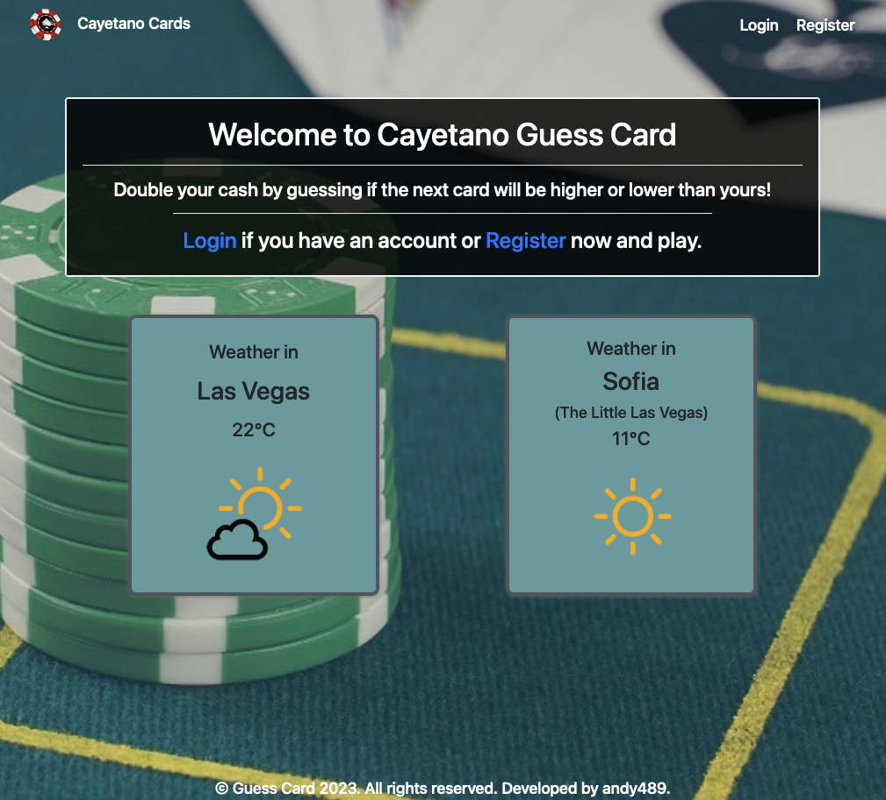
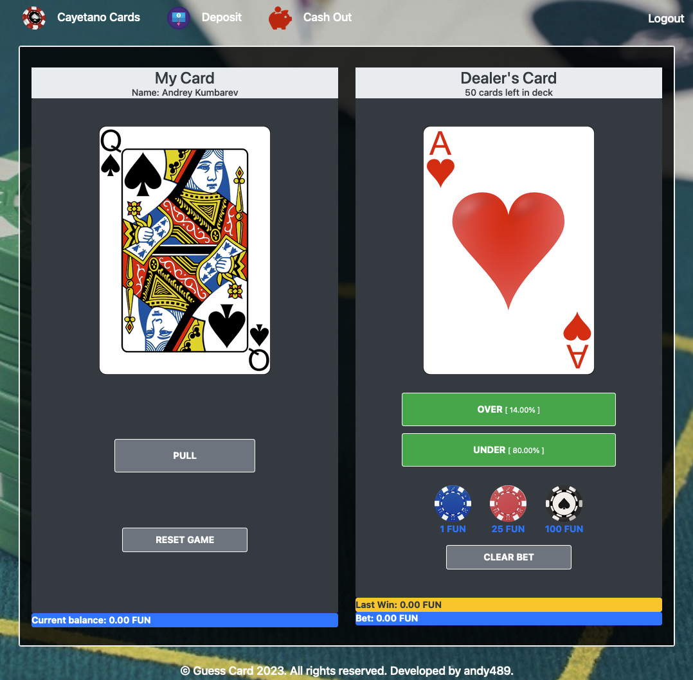

# Guess Card Game (WAR)

Cayetano Cards is a simple gambling card game that resembles War or Baccarat but with one card each for the player and the dealer and no second draw under specific conditions. The aim of the game is to predict the outcome of whether the card that will draw the dealer is of a higher or lower face value than the card that drew the player.

The cards have the following values:
- Aces are the strongest cards and are worth 14 points each. 
- Cards 2 through 10 match the number written on the face of the card.
- Jacks, Queens, and Kings are worth 11, 12, and 13 points, respectively.
- Jokers are used for default or divider cards. For example, we place a joker on a player's card when the player has not yet drawn a card from the deck. We place a joker for a dealer's card when a guess has not yet been made as to what his card will be or the deck has run out of cards.
  
Only the numerical value of each card matters in the main game. Any suit of cards (jacks, spades, spades or diamonds) is irrelevant.

Initially, a card must be drawn from the deck of cards and a bet must be made in the dealer's section. You then have to guess whether the dealer's card will be of higher or lower value. If known - the bet is doubled. If you don't know - the bet is lost. In case of equal numerical values - the bet remains unchanged and is returned to the player's balance (in this case, you neither won nor lost, but the bet value is noted in the "last win" section). More information can be found in the documentation of the project/game here: [DOCUMENTATION](https://github.com/andy489/Guess_Card_Game/blob/main/assets/Guess%20Card%20Documentation.pdf) 
  
## How to start the Game Server

0. Check out project using `git clone https://github.com/andy489/Guess_Card_Game.git`
1. Configure the database connection to work with your database in the application.yml file [location: /src/main/resources/application.yml].
Current configuration:
```yaml
spring:
  datasource:
    driverClassName: com.mysql.cj.jdbc.Driver
    url: jdbc:mysql://localhost:3306/guess_card?createDatabaseIfNotExist=true
    username: root
    password: root
  jpa:
    database-platform: org.hibernate.dialect.MySQLDialect
```
2. Run `./gradlew build ` to build the application. Hibernate will create tables automatically (Only in MySQL, so if you are using PostgreSQL, Oracle or some other database, you must create first the database 'cayetano_cards' manually).
3. Run application with: `java -jar ./build/libs/GuessCard-0.0.1-SNAPSHOT.jar ./src/main/java/com/cayetano/guesscard/GuessCardApplication.java`
4. Enter URL `http://localhost:8080` in the browser and PLAY!

## Play

You can find more about the game flow in the [DOCUMENTATION](https://github.com/andy489/Guess_Card_Game/blob/main/assets/Guess%20Card%20Documentation.pdf) in section 7.

ENJOY!

<div align="center">
  <kbd>
    
  </kbd>
  <kbd>
    
  </kbd>
</div>
  
